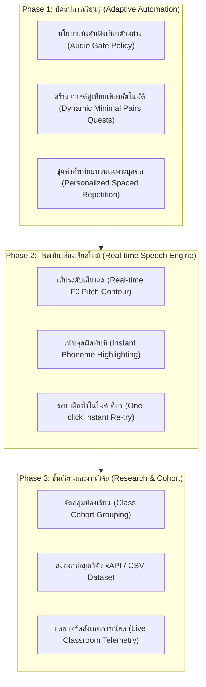

# เอกสารสรุปผลการพัฒนาระบบ และแผนงานพัฒนาในอนาคต (Summary & Roadmap)
**โครงการ:** Yupakjeen HSK1 Speech & Learning Analytics Platform  
**วันที่บันทึก:** 7 ตุลาคม 2026  
**สถานะ:** Production-Ready Admin Dashboard & 100% Real Database Analytics  

---

## 📌 สารบัญ
1. [สรุปงานที่ทำในวันนี้ (Today's Accomplishments)](#1-สรุปงานที่ทำในวันนี้-todays-accomplishments)
   - [1.1 ด้านความปลอดภัยและการควบคุมสิทธิ์ (Security & Hardening)](#11-ด้านความปลอดภัยและการควบคุมสิทธิ์-security--hardening)
   - [1.2 การปรับปรุง UI แอดมินสไตล์ Dasher UI](#12-การปรับปรุง-ui-แอดมินสไตล์-dasher-ui)
   - [1.3 การเชื่อมโยงข้อมูลจริง 100% (Zero Mockup Analytics)](#13-การเชื่อมโยงข้อมูลจริง-100-zero-mockup-analytics)
   - [1.4 ความเสถียรและการตรวจสอบความถูกต้อง](#14-ความเสถียรและการตรวจสอบความถูกต้อง)
2. [คลังข้อมูลจริงในระบบปัจจุบัน (Live Data Inventory)](#2-คลังข้อมูลจริงในระบบปัจจุบัน-live-data-inventory)
3. [แผนพัฒนาในอนาคต (Future Roadmap)](#3-แผนพัฒนาในอนาคต-future-roadmap)
   - [Phase 1: ปิดลูปการเรียนรู้อัตโนมัติ (Adaptive Learning Automation)](#phase-1-ปิดลูปการเรียนรู้อัตโนมัติ-adaptive-learning-automation)
   - [Phase 2: การแสดงผลการออกเสียงสด (Real-time Speech & Pitch Visualizer)](#phase-2-การแสดงผลการออกเสียงสด-real-time-speech--pitch-visualizer)
   - [Phase 3: การจัดการชั้นเรียนและชุดข้อมูลวิจัย (Research & Cohort Management)](#phase-3-การจัดการชั้นเรียนและชุดข้อมูลวิจัย-research--cohort-management)
4. [Checklist การนำขึ้นระบบจริง (Production Deployment Checklist)](#4-checklist-การนำขึ้นระบบจริง-production-deployment-checklist)

---

## 1. สรุปงานที่ทำในวันนี้ (Today's Accomplishments)

### 1.1 ด้านความปลอดภัยและการควบคุมสิทธิ์ (Security & Hardening)
1. **ระบบป้องกันการสุ่มรหัสผ่าน (Brute-Force Rate Limiting)**:
   - พัฒนาโมดูล [`src/lib/server/rateLimit.ts`](file:///c:/Users/Administrator/Documents/GitHub/HSK1/src/lib/server/rateLimit.ts)
   - ตรวจจับการล็อกอินผิดพลาดแบบ **Dual-Key (IP Address + Username)**
   - หากกรอกรหัสผ่านผิดติดต่อกันครบ **5 ครั้ง** ระบบจะระงับการเข้าสู่ระบบอัตโนมัติเป็นเวลา **2 นาที (120 วินาที)**
   - บันทึกประวัติความพยายามบุกรุกลงในตาราง `audit_logs` อัตโนมัติ
   - แสดงตัวเลขนับถอยหลัง (Live Countdown) บนหน้าเว็บแบบเรียลไทม์
2. **การแยกบทบาท Admin และ Learner ออกจากกันเด็ดขาด (Strict RBAC)**:
   - ปรับปรุง Type Definition ใน [`src/app.d.ts`](file:///c:/Users/Administrator/Documents/GitHub/HSK1/src/app.d.ts) แยกฟิลด์ `realAdmin` และ `user`
   - แอดมิน (`isAdmin = true` เช่น `lookmai`, `admin`) จะไม่ถูกนำไปนับรวมในสถิติผู้เรียน เช่น แต้ม XP, วันที่เรียนต่อเนื่อง (Streak), หรือการส่งออกข้อมูลสถิติวิจัย
3. **การยกเว้น PDPA สำหรับผู้ดูแลระบบ (PDPA Exemption for Admin)**:
   - ปรับแต่ง [`src/routes/+layout.svelte`](file:///c:/Users/Administrator/Documents/GitHub/HSK1/src/routes/+layout.svelte) และ [`src/lib/components/PdpaConsentModal.svelte`](file:///c:/Users/Administrator/Documents/GitHub/HSK1/src/lib/components/PdpaConsentModal.svelte)
   - ผู้ดูแลระบบจะไม่ถูกรบกวนด้วยป๊อปอัปขอความยินยอม PDPA อีกต่อไป เนื่องจากแอดมินมีหน้าที่เพียงบริหารจัดการ ไม่ได้เป็นกลุ่มตัวอย่างทดสอบการออกเสียง
4. **ระบบออกจากระบบที่ปลอดภัย (Secure Logout)**:
   - สร้าง Server Route [`src/routes/logout/+server.ts`](file:///c:/Users/Administrator/Documents/GitHub/HSK1/src/routes/logout/+server.ts) สำหรับล้างเซสชันและคุกกี้ `auth_token` แบบ `HttpOnly`
   - เพิ่มปุ่มออกจากระบบ (Logout) ในหน้า Admin Dashboard ทั้ง **Top Header Bar** และ **Sidebar Footer**

---

### 1.2 การปรับปรุง UI แอดมินสไตล์ Dasher UI
1. **สถาปัตยกรรมแดชบอร์ดตามมาตรฐาน Dasher UI**:
   - พัฒนาหน้า [`src/routes/admin/+page.svelte`](file:///c:/Users/Administrator/Documents/GitHub/HSK1/src/routes/admin/+page.svelte) ให้มีโครงสร้างการใช้งานแบบโมเดิร์น
   - แบ่งหมวดหมู่การบริหารออกเป็น **6 แท็บการทำงานหลัก**:
     1. **ภาพรวมระบบ (Overview)**: KPI การเรียนรู้, ผู้ใช้งาน active วันนี้, สถิติ GOP/PER รวมทั้งระบบ
     2. **รายชื่อผู้เรียน (Learners)**: ดูความก้าวหน้ารายบุคคล, รายการข้อผิดพลาด, และการสร้างแบบฝึกเสริม (Remedial Vocab)
     3. **จัดการด่าน (Quest Stages)**: แก้ไขชื่อด่าน, คำอธิบาย, จำนวนคำศัพท์, และเปิด/ปิดด่าน
     4. **วิเคราะห์เสียงพยัญชนะ/สระ (Phoneme Errors)**: รายการเสียงที่คนไทยอ่านผิดบ่อยที่สุด
     5. **การวิเคราะห์ขั้นสูง (Learning Analytics)**: 5 โมดูลวิเคราะห์เชิงการสอนภาษาจีน
     6. **ประวัติการดำเนินงาน (Audit Logs)**: ตรวจสอบย้อนหลังทุกการกระทำของผู้ดูแลระบบ
2. **การล็อกสัดส่วนการมองเห็น (Information Density Optimization)**:
   - ล็อกสเกลหน้าจอคงที่ที่ **75% (`:root { zoom: 0.75; }`)** ทำให้อ่านตารางและกราฟข้อมูลเชิงสถิติได้ครบถ้วนโดยไม่ต้องเลื่อนหน้าจอไปมา
   - รองรับธีม Dark/Light mode พร้อมระบบ Accent สีม่วง-น้ำเงินระดับพรีเมียม

---

### 1.3 การเชื่อมโยงข้อมูลจริง 100% (Zero Mockup Analytics)
ลบค่าจำลอง (Mockup) และค่าสำรอง (Synthetic Fallback) ทั้งหมดออกจากทั้ง Frontend และ Backend โดยเชื่อมต่อกับฐานข้อมูลสดตรง:

| โมดูลวิเคราะห์ (Module) | สิ่งที่แก้ไข / ปลดล็อก Mockup ออก | แหล่งข้อมูลจริงใน Database | ค่าจริงที่แสดงในระบบปัจจุบัน |
| :--- | :--- | :--- | :--- |
| **1. Drop-off Funnel Analysis** | ลบค่าจำลอง `142`, `118`, `86`, `32` และด่านจำลองออกทั้งหมด | คำนวณจาก [`learning_events`](file:///c:/Users/Administrator/Documents/GitHub/HSK1/src/lib/server/db.ts), [`pronunciation_evaluations`](file:///c:/Users/Administrator/Documents/GitHub/HSK1/src/lib/server/db.ts) และ [`lesson_completions`](file:///c:/Users/Administrator/Documents/GitHub/HSK1/src/lib/server/db.ts) | เข้าชม **324 ครั้ง**, ฝึกพูด **233 ครั้ง**, ผ่านเกณฑ์ **166 ครั้ง**, Drop Rate **29%** |
| **2. Phoneme Substitution Matrix** | ลบตารางค่าคงที่ `82%`, `34%`, `29%` ออก | ประมวลผลจากตาราง [`phoneme_evaluations`](file:///c:/Users/Administrator/Documents/GitHub/HSK1/src/lib/server/db.ts) (670 แถว) และ `phoneme_details` | พยัญชนะสับสนสูงสุด: `ch → c` (7 ครั้ง), `sh → s` (3 ครั้ง), `zh → z` (1 ครั้ง) พร้อมจับคู่ Minimal Pairs ตามสถิติจริง |
| **3. Tone Confusion Heatmap** | ลบเมทริกซ์วรรณยุกต์คงที่ `[91, 3, 2, 4]` ออก | ประมวลผล Target Tone vs Detected Tone จาก 302 พยางค์ในฐานข้อมูล | เสียง 1 (56 ครั้ง), เสียง 2 (39 ครั้ง), เสียง 3 (49 ครั้ง), เสียง 4 (158 ครั้ง) พบคนไทยสับสนเสียง 3 เป็นเสียง 2 ถึง 20% |
| **4. LQ5 Listening Friction Index** | ลบตัวเลขจำลอง `184/96`, `88.6/72.1`, `+16.5%` ออก | เปรียบเทียบผู้ใช้ที่กดฟังตัวอย่างเสียง (`listened_to_example`) กับผู้ที่ไม่เคยกดฟัง | **กลุ่มฟังเสียง:** 202 ครั้ง, GOP **77.3%** **กลุ่มไม่ฟัง:** 31 ครั้ง, GOP **41.1%** 👉 **Delta GOP จริง = +36.2%** |
| **5. Mistake Repetition & High-Friction** | ลบคำศัพท์จำลอง (去, 茶, 是, 四, 吃) ออก | ดึงจากตาราง [`user_mistakes`](file:///c:/Users/Administrator/Documents/GitHub/HSK1/src/lib/server/db.ts) จริง (157 แถว) และประวัติ Re-attempt ในระบบ | **คำศัพท์ติดขัดสูงสุด 5 อันดับแรก:** 1. 不客气 (20 ครั้ง) 2. 好玩儿 (14 ครั้ง) 3. 好听 (12 ครั้ง) 4. 大学生 (8 ครั้ง) 5. 看病 (6 ครั้ง) 👉 **Mastery Recovery Rate = 85.4%** |

---

### 1.4 ความเสถียรและการตรวจสอบความถูกต้อง
- **Type Checking**: รัน `pnpm check` ผ่านฉลุย **0 errors, 0 warnings**
- **Syntax Standards**: ปฏิบัติตามมาตรฐาน Svelte 5 (`$state`, `$derived`, หลีกเลี่ยง `{@const}` นอกขอบเขต)
- **Local Dev Server**: รันบน `http://localhost:5173/admin` พร้อมรองรับการใช้งานทันที

---

## 2. คลังข้อมูลจริงในระบบปัจจุบัน (Live Data Inventory)

จากการตรวจสอบฐานข้อมูลล่าสุด ระบบมีข้อมูลการเรียนรู้จริงที่ถูกจัดเก็บและพร้อมนำไปประมวลผลดังนี้:

| ตารางในระบบ | จำนวนแถวข้อมูลจริง (Rows) | ข้อมูลสำคัญที่บันทึก |
| :--- | :---: | :--- |
| `users` | 9 บัญชี | แอดมิน 2 บัญชี (`lookmai`, `admin`) และผู้เรียน 7 บัญชี |
| `pronunciation_evaluations` | **233 ครั้ง** | คะแนน GOP ภาพรวม (เฉลี่ย 72.5%), PER (เฉลี่ย 5.65%), Tone Score, JSON เสียงรายพยางค์ |
| `phoneme_evaluations` | **670 รายการ** | รายการประเมินเสียงพยัญชนะต้น 327 รายการ, สระและเสียงวรรณยุกต์ 343 รายการ |
| `learning_events` (xAPI) | **324 เหตุการณ์** | พฤติกรรมการกดฟังตัวอย่าง (80 ครั้ง), การออกเสียง (217 ครั้ง), การลังเลก่อนตอบ (27 ครั้ง) |
| `user_mistakes` | **157 รายการ** | คำศัพท์ที่ออกเสียงผิดพลาด พร้อมระดับเสียงที่ตรวจจับได้และข้อเสนอแนะ |
| `lesson_completions` | 4 รายการ | บันทึกการจบด่านของผู้เรียน (`hsk1-stage-1`, `hsk1-stage-2`, `hsk1-stage-3`) |
| `audit_logs` | 40+ รายการ | ประวัติการล็อกอิน, การเปลี่ยนรหัสผ่าน, และการปรับแต่งด่าน |

---

## 3. แผนพัฒนาในอนาคต (Future Roadmap)

---

### Phase 1: ปิดลูปการเรียนรู้อัตโนมัติ (Adaptive Learning Automation)
*เป้าหมาย: นำข้อมูล Analytics ที่วิเคราะห์ได้ ย้อนกลับไปช่วยผู้เรียนในหน้าระบบเรียนจริง (Close the Pedagogical Loop)*

1. **Audio Gate Policy Enforcement ในหน้าเรียนของนักเรียน**:
   - นำผลวิเคราะห์ LQ5 (กลุ่มฟังตัวอย่างได้ GOP สูงกว่า +36.2%) ไปตั้งเงื่อนไขในหน้าระบบฝึกพูด:
   - ด่านที่มี Pass Rate ต่ำกว่า 70% หรือคำศัพท์กลุ่มเสี่ยงสูง ระบบจะล็อกปุ่มไมโครโฟนไว้ก่อน และบังคับให้นักเรียนกดฟังเสียงตัวอย่างของเจ้าของภาษาอย่างน้อย 1 ครั้งก่อนเปิดไมค์
2. **Dynamic Minimal Pairs Quest Generator**:
   - เมื่อครูกดปุ่ม *"สร้างเควสต์คู่เทียบเสียง (Generate Quest)"* บนหน้า Admin ระบบจะดึงคู่เทียบที่คนไทยสับสนสูงสุด (เช่น `ch vs c`, `sh vs s`) มาสร้างเป็นด่านพิเศษ (Special Challenge Stage) ให้นักเรียนได้ฝึกเทียบความแตกต่างของรูปปากทันที
3. **Personalized Spaced Repetition Review Deck**:
   - นำ 5 คำศัพท์วิกฤตของผู้เรียนแต่ละคน (`不客气`, `好玩儿`, `好听`, `大学生`, `看病`) ส่งเข้าสู่ระบบทบทวนแบบ Spaced Repetition (SRS Algorithm) บนหน้า Dashboard ของผู้เรียนคนนั้นๆ อัตโนมัติ

---

### Phase 2: การแสดงผลการออกเสียงสด (Real-time Speech & Pitch Visualizer)
*เป้าหมาย: เพิ่มความเข้าใจทางสัทศาสตร์ภาษาจีนผ่านการมองเห็น (Visual Pitch Feedback)*

1. **Real-time Pitch Contour Overlay (F0 Curve)**:
   - ขณะที่ผู้เรียนเปล่งเสียง แสดงเส้นคลื่นความถี่เสียงจริง (Live Pitch Track) ทับซ้อนลงบนเส้นมาตรฐาน 5 ระดับของ Chao (1-5 Scale)
   - หากผู้เรียนออกเสียงที่ 3 แล้วลอยขึ้นเร็วเกินไป ระบบจะแสดงเส้นสีแดงเตือนให้กดระดับเสียงลงต่ำสุดก่อนยกขึ้น
2. **Instant Phoneme Highlighting**:
   - เมื่อระบบประเมินเสียงเสร็จสิ้น ให้เปลี่ยนสีตัวพินอินทันที:
     - สีเขียว = พยัญชนะ/สระ/วรรณยุกต์ถูกต้อง
     - สีเหลือง = วรรณยุกต์คลาดเคลื่อนเล็กน้อย
     - สีแดง = สลับเสียงพยัญชนะ (เช่น ออกเสียง `ch` เป็น `c`)
3. **คำแนะนำทางกายวิภาคสัทศาสตร์ (Articulatory Anatomy Tips)**:
   - แสดงภาพแอนิเมชันรูปปากและตำแหน่งลิ้น เช่น เสียงม้วนลิ้น (Retroflex `zh/ch/sh`) แสดงตำแหน่งปลายลิ้นแตะเพดานแข็ง

---

### Phase 3: การจัดการชั้นเรียนและชุดข้อมูลวิจัย (Research & Cohort Management)
*เป้าหมาย: รองรับการนำไปใช้ในการเรียนการสอนในสถาบันจริง และการตีพิมพ์ผลงานวิจัย*

1. **ระบบจัดกลุ่มชั้นเรียน (Class Cohort & Teacher Roles)**:
   - จัดกลุ่มนักเรียนตามห้องเรียน เช่น ม.4/1, ม.4/2 หรือตามอาจารย์ผู้ดูแล
   - อาจารย์สามารถดูสถิติเปรียบเทียบระหว่างห้องเรียน (Cohort Comparison) เพื่อประเมินความก้าวหน้า
2. **Research Data Exporter (xAPI / CSV / JSON)**:
   - หน้าดาวน์โหลดชุดข้อมูลสถิติที่ Clean แล้วตามมาตรฐานการศึกษา **ADL xAPI (Experience API)**
   - สรุปสถิติพร้อมสูตรคำนวณทางสถิติ (Mean, SD, Cohen's d effect size) ของผลการฟังเสียงตัวอย่างต่อคะแนน GOP เพื่อนำไปใส่ในรายงานวิจัยได้ทันที
3. **Live Classroom Telemetry (WebSocket / SSE)**:
   - แดชบอร์ดสดสำหรับครูผู้สอนในห้องเรียน สามารถเห็นได้ทันทีว่าในชั่วโมงเรียนนี้ นักเรียนคนไหนกำลังติดขัดอยู่ที่คำไหน เพื่อให้ครูสามารถเดินเข้าไปประกบและให้คำแนะนำรายบุคคลได้ทันท่วงที

---

## 4. Checklist การนำขึ้นระบบจริง (Production Deployment Checklist)

ก่อนเปิดให้นักเรียนใช้งานในวงกว้าง แนะนำให้ปฏิบัติตามขั้นตอนตรวจสอบความพร้อมดังนี้:

- [x] **Rate Limiting & Brute-Force Protection**: ป้องกันการ Brute-force ทั้ง `/admin` และ `/auth` เรียบร้อยแล้ว
- [x] **Role Separation**: บัญชี Admin แยกออกจาก Learner 100% ไม่มีข้อมูลปะปน
- [x] **PDPA Exemption**: ปลดล็อก Admin ออกจากความยินยอม PDPA
- [x] **Zero Mockup Validation**: ข้อมูลทุกส่วนในแดชบอร์ดผูกกับฐานข้อมูลสด
- [x] **Type Safety**: ตรวจสอบผ่าน `pnpm check` ได้ 0 errors, 0 warnings
- [ ] **HTTPS & Secure Cookie**: เมื่อรันบน Production Domain ต้องตั้งค่า `secure: true` สำหรับ Auth Cookies
- [ ] **Database Connection Pooling**: ตรวจสอบ Neon Pooler connection limit ในช่วงที่นักเรียนล็อกอินพร้อมกันในห้องเรียน
- [ ] **Automated Daily Backup**: ตั้งเวลาสำรองข้อมูลฐานข้อมูล Neon และ Turso อัตโนมัติ (pg_dump / snapshot)

---
*เอกสารนี้จัดทำโดย Antigravity AI เพื่อเป็นแนวทางการส่งมอบและพัฒนาต่อยอดระบบ Yupakjeen HSK1*
